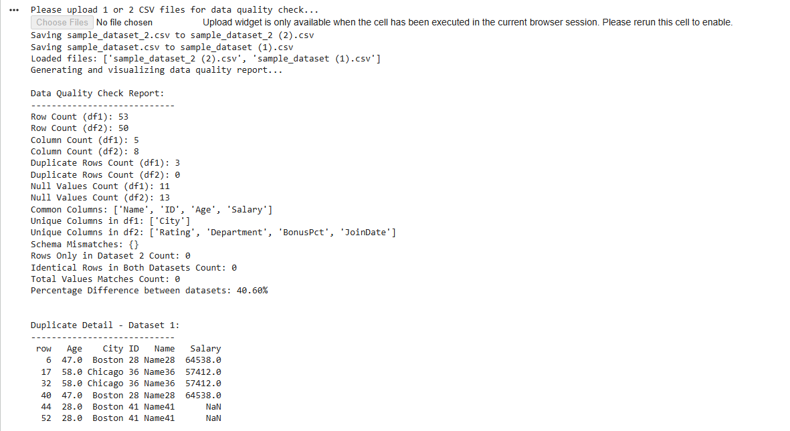
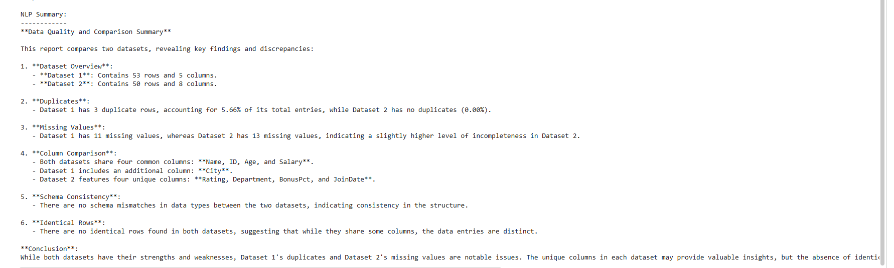
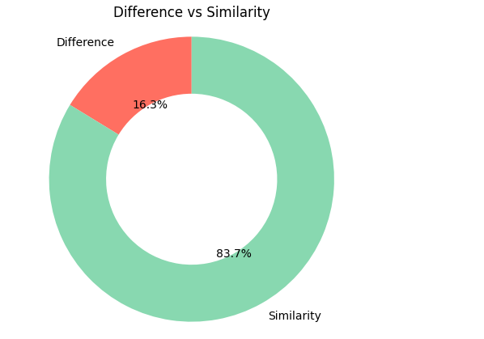

# AI-Powered Data Insight Engine

> Drop your CSV files. Get instant data quality reports, AI-generated insights, visual charts, and a downloadable PDF — no code required.



---

## The Problem It Solves

Data analysts and engineers spend hours doing the same repetitive work every time they receive a new dataset:

- Manually checking for missing values, duplicates, and schema issues
- Writing comparison scripts when two versions of a dataset need to be audited
- Translating raw statistics into plain English for stakeholders
- Building charts to visualise distributions and differences
- Compiling all of it into a report

This tool automates that entire workflow. Upload one or two CSVs, hit **Analyse**, and get a complete report in under 30 seconds.

---

## Demo

| Upload & Hero | Dataset Overview |
|---|---|
|  |  |

| AI Insights | Charts |
|---|---|
|  |  |


---

## What It Does

### Single Dataset Mode
Upload one CSV and get:
- Row/column counts, duplicate detection, missing value breakdown per column
- Anomaly detection (negative values in numeric columns)
- Correlation heatmap, distribution histograms, data type breakdown
- AI summary with specific findings and recommendations

### Two Dataset Comparison Mode
Upload two CSVs and get everything above, plus:
- Fuzzy column matching — finds corresponding columns even if names differ slightly (e.g. `emp_id` ↔ `EmployeeID`)
- Schema diff — columns present in one dataset but not the other
- Data type mismatch detection across common columns
- Side-by-side missing value comparison
- Box plots for numeric column distributions
- Key column analysis — specify columns like `ID` to check uniqueness and duplicate rates
- AI summary comparing both datasets with concrete numbers

### PDF Export
Every analysis generates a downloadable PDF containing the full overview, AI insights text, and all charts embedded as images.

---

## How It Works

```
Upload CSV(s)
     ↓
Data Quality Engine  ──  detects nulls, duplicates, anomalies, schema mismatches
     ↓
Fuzzy Column Matcher  ──  aligns columns across two datasets using string similarity
     ↓
Stats Engine  ──  computes mean, std, min, max per matched numeric column
     ↓
LLaMA 3.3 70B (via Groq)  ──  generates a structured natural language analysis
     ↓
Chart Generator  ──  builds box plots, heatmaps, histograms, correlation matrix
     ↓
PDF Builder  ──  compiles everything into a downloadable report
```

---

## Tech Stack

| Layer | Tool | Why |
|---|---|---|
| UI | Gradio | Fast, local web interface with file upload support |
| LLM | LLaMA 3.3 70B via Groq | Free, fast, high-quality analysis |
| LLM Orchestration | LangChain | Clean prompt/response pipeline |
| Data Processing | Pandas + NumPy | Industry standard for tabular data |
| Charts | Matplotlib | Precise, customisable static charts |
| Column Matching | FuzzyWuzzy | Fuzzy string matching for column alignment |
| PDF Generation | ReportLab | Programmatic PDF with embedded images |
| Config | python-dotenv | Secure API key management |

---

## Project Structure

```
ai-data-insight-engine/
├── app.py                      # Main Gradio app — UI + analysis pipeline
├── src/
│   └── data_quality.py         # Data quality engine (quality reports, comparison, fuzzy matching)
├── sample_employees_2023.csv   # Sample dataset for testing
├── sample_employees_2024.csv   # Sample dataset for testing
├── requirements.txt            # Python dependencies
├── package.json                # npm scripts (npm run dev)
├── .env.example                # API key template
└── .gitignore
```

---

## Getting Started

### 1. Clone the repo
```bash
git clone https://github.com/adithyaraghavv/ai-data-insight-engine
cd ai-data-insight-engine
git checkout claude/new-session-thlu8u
```

### 2. Install dependencies
```bash
pip install -r requirements.txt
```

### 3. Set your API key
Get a free key at [console.groq.com](https://console.groq.com)
```bash
cp .env.example .env
# Open .env and paste your GROQ_API_KEY
```

### 4. Run
```bash
npm run dev
```
Open **http://localhost:7860** in your browser.

---

## Usage

1. **Upload** one or two CSV files
2. **Key Columns** *(optional)* — type column names like `ID, Name` for deeper duplicate and uniqueness checks
3. Click **Analyse**
4. Browse the four result tabs:
   - **Overview** — dataset stats table, schema diff, matched columns
   - **AI Insights** — structured natural language analysis from LLaMA 3.3 70B
   - **Charts** — up to 6 charts: null comparison, box plots, correlation heatmap, missing values heatmap
   - **Export** — download the full report as a PDF

---

## Use Cases

- **Data auditing** — verify a dataset before loading it into a database or model
- **Period comparison** — compare sales, HR, or operational data across two time periods
- **ETL validation** — confirm source and target datasets match after a pipeline run
- **Stakeholder reporting** — generate a readable PDF report without writing any code
- **Data onboarding** — quickly profile an unfamiliar dataset on day one

---

## Environment Variables

| Variable | Required | Description |
|---|---|---|
| `GROQ_API_KEY` | Yes | API key from [console.groq.com](https://console.groq.com) |
| `GRADIO_SHARE` | No | Set to `true` to get a public shareable Gradio link |
